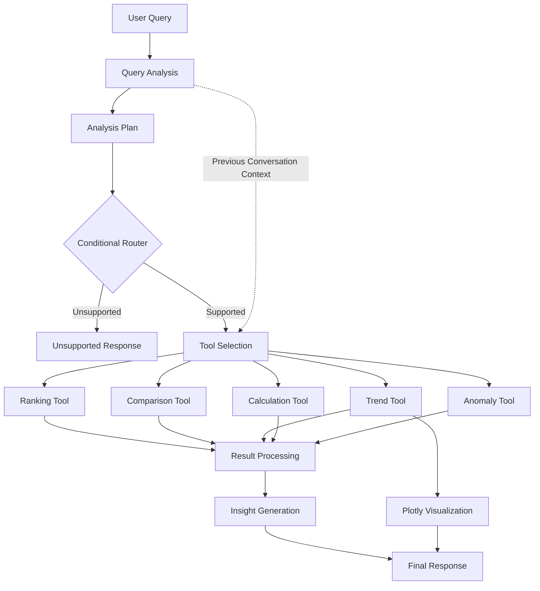

# Insight Copilot

Insight Copilot is a reasoning and tool-using analytics chatbot built with LangGraph. It allows users to ask natural-language questions about a sales dataset and returns data-driven insights, comparisons, trends, calculations, anomaly detection, and visualizations.

The application uses a LangGraph workflow to analyze the user's question, create an analysis plan, select the appropriate tools, process the results, and generate a concise insight.

---

## Project Overview

Insight Copilot is a tool-using analytics chatbot designed to answer natural-language questions about a sales dataset. The main goal of the project is to demonstrate how an AI system can combine language understanding with deterministic data-analysis tools instead of relying on an LLM for every operation.

When a user submits a question, the LangGraph workflow first analyzes the query and creates a short analysis plan. A conditional routing step then determines whether the question can be handled by the supported analytical capabilities. For supported questions, the system selects the relevant tools and executes them before processing the results and generating the final insight.

The application provides separate tools for ranking, comparison, monthly trend analysis, calculations, anomaly detection, and visualization. This separation makes the analytical operations easier to test and reduces the need for the language model to perform numerical calculations itself. For example, totals and percentage changes are calculated directly with Python, while the language model is primarily used for understanding questions and generating natural-language insights.

The system also supports multi-turn questions. Previous conversation context can be used when a follow-up question refers to an entity identified in an earlier response, such as asking for the monthly trend of the product that was previously identified as the highest-revenue product.

The application uses Ollama with Qwen3 4B for local language-model inference, Pandas for data analysis, Plotly for visualizations, and Streamlit for the user interface. The UI exposes the analysis plan, selected tools, execution log, final insight, and relevant visualizations, making the workflow inspectable without exposing private model chain-of-thought.

The project prioritizes a clear and testable agent architecture over adding unnecessary infrastructure. The current implementation is intended as an analytics assistant for the provided dataset and can be extended with additional tools, stronger query classification, evaluation mechanisms, and a cloud-compatible inference backend.

---

## Features

- Natural-language questions about sales data
- LangGraph-based agent workflow
- Typed agent state using `TypedDict`
- Conditional routing for supported and unsupported questions
- Multiple specialized analysis tools
- Ranking and comparison analysis
- Monthly trend and month-over-month analysis
- Percentage-change and total calculations
- IQR-based anomaly detection
- Interactive Plotly visualizations
- Multi-turn follow-up questions using conversation context
- Visible analysis plan
- Visible tools used and execution log
- Local LLM inference using Ollama and Qwen3 4B
- Streamlit chatbot interface

---

## Architecture

The application follows this workflow:



### LangGraph Flow

The main graph is implemented using LangGraph `StateGraph`.

The workflow contains:

1. **`analyze_query`**
   - Identifies the type of analysis required.
   - Selects the relevant tools.
   - Uses previous conversation context when applicable.

2. **`create_plan`**
   - Creates a short, user-visible analysis plan.

3. **Conditional routing**
   - Routes unsupported questions to the unsupported-question handler.
   - Routes supported questions to tool execution.

4. **`run_selected_tools`**
   - Executes the tools required for the current question.

5. **`process_results`**
   - Converts raw tool outputs into structured analysis results.

6. **`generate_insight`**
   - Produces a concise analyst-style response.

---

## Tools

### 1. Ranking Tool

File:

`tools/data_tool.py`

Used for questions such as:

- Which product generated the highest revenue?
- Which region had the lowest profit?
- What are the top products?

---

### 2. Comparison Tool

File:

`tools/data_tool.py`

Used to compare metrics across groups such as:

- Regions
- Products
- Categories
- Salespeople

Example:

> Compare revenue across regions.

---

### 3. Trend Tool

File:

`tools/trend_tool.py`

Calculates monthly values and month-over-month percentage changes.

Example:

> What was the monthly revenue trend?

The tool can also analyze the trend of a specific product when previous conversation context identifies the product.

---

### 4. Calculation Tool

File:

`tools/calculation_tool.py`

Provides deterministic numerical calculations such as:

- Total revenue
- Total profit
- Total units sold
- Percentage change

Calculations are performed using Python rather than relying on the LLM to perform arithmetic.

---

### 5. Anomaly Detection Tool

File:

`tools/anomaly_tool.py`

Uses the Interquartile Range (IQR) method to identify potential outliers.

Example:

> Are there any unusual profit values in the dataset?

The result is described as potential anomalies because statistical outliers do not automatically represent errors.

---

### 6. Visualization Tool

File:

`tools/visualization_tool.py`

Creates interactive Plotly charts for monthly trend analysis.

---

## Dataset

The project uses the `Sales_Dataset_2024.xlsx` dataset.

The dataset is intentionally not included in the GitHub repository because the redistribution license for the original Kaggle listing was not verified.

For local development, place the file at:

```text
data/Sales_Dataset_2024.xlsx
```

For the deployed Streamlit application, upload the Excel file through the dataset uploader shown in the application.

The dataset contains 2,000 rows and 10 columns:

- Date
- Region
- Product
- Salesperson
- Units_Sold
- Unit_Price
- Category
- Revenue
- Cost
- Profit

The data covers January 2024 through December 2024.

### Data Preparation

The data loader performs basic cleaning:

- Converts the `Date` column to datetime
- Replaces missing categorical values with `Unknown`
- Removes surrounding whitespace
- Normalizes known inconsistent region labels
- Normalizes known inconsistent product labels
- Preserves missing numerical values rather than replacing them with zero
- Preserves negative values because they may represent valid corrections, returns, or unusual transactions

File:

`utils/data_loader.py`

---

## Example Questions

### Ranking

> Which product generated the highest revenue?

Example result:

> The product with the highest revenue is Tablet (2,929,329).

### Comparison

> Compare revenue across regions.

### Trend

> What was the monthly revenue trend?

The application provides both a textual summary and an interactive chart.

### Calculation

> What is the total revenue?

### Percentage Change

> What was the percentage change in revenue from January to December?

### Anomaly Detection

> Are there any unusual profit values in the dataset?

### Multi-tool Question

> Which product generated the highest revenue, and what was its monthly trend?

For this type of question, the system uses both the ranking and trend tools.

### Follow-up Question

> Which product generated the highest revenue?

followed by:

> What was its monthly trend?

The second question uses the previous conversation context to analyze the identified product.

---

## Technology Stack

| Technology | Purpose |
|---|---|
| Python | Application development |
| LangGraph | Agent workflow and state graph |
| LangChain | LLM integration |
| Ollama | Local LLM runtime |
| Qwen3 4B | Local language model |
| Pandas | Data analysis |
| NumPy | Numerical operations |
| Plotly | Interactive visualization |
| Streamlit | Chatbot interface |
| OpenPyXL | Excel file loading |

---

## Why LangGraph?

LangGraph was selected because the assignment requires a stateful, multi-step workflow rather than a single LLM call.

It provides:

- Explicit workflow nodes
- Typed state
- Conditional routing
- Multi-step tool execution
- Support for maintaining context across workflow steps

The graph makes the agent's decision process easier to inspect and explain.

---

## Why Ollama and Qwen3?

The project uses Ollama with Qwen3 4B so that the application can run locally without requiring a paid LLM API.

This also avoids putting API credentials into the project.

The model is used primarily for language understanding and insight generation, while deterministic Python tools handle calculations and data analysis.

For Streamlit Cloud deployment, where the local Ollama runtime is unavailable, the application falls back to deterministic tool results when the LLM cannot be reached.

---

## Local Setup

### 1. Clone the repository

```bash
git clone https://github.com/apurvabarve99/insight-copilot.git
cd insight-copilot
```

### 2. Create a virtual environment

```bash
python3 -m venv .venv
source .venv/bin/activate
```

### 3. Install dependencies

```bash
pip install -r requirements.txt
```

### 4. Add the dataset

Place:

```text
Sales_Dataset_2024.xlsx
```

inside:

```text
data/
```

### 5. Install and run Ollama

Install Ollama separately and make sure the Qwen3 4B model is available:

```bash
ollama pull qwen3:4b
```

Then start the model when needed:

```bash
ollama run qwen3:4b
```

### 6. Run the Streamlit application

Open another terminal with the virtual environment activated and run:

```bash
streamlit run app.py
```

---

## Testing

The project includes automated tests for the main analytical tools.

Run:

```bash
pytest
```

The tests cover:

- Calculation functions
- Percentage change
- Ranking
- Region summaries
- Monthly summaries
- Trend analysis
- Anomaly detection

---

## Project Structure

```text
insight_copilot/
│
├── agent/
│   ├── graph.py
│   ├── nodes.py
│   └── state.py
│
├── data/
│   └── Sales_Dataset_2024.xlsx   # local only
│
├── tests/
│   └── test_tools.py
│
├── tools/
│   ├── __init__.py
│   ├── anomaly_tool.py
│   ├── calculation_tool.py
│   ├── data_tool.py
│   ├── trend_tool.py
│   └── visualization_tool.py
│
├── utils/
│   ├── __init__.py
│   └── data_loader.py
│
├── app.py
├── requirements.txt
├── pytest.ini
├── .env.example
└── .gitignore
```

---

## Design Decisions

### Deterministic tools for numerical analysis

Numerical calculations and dataset operations are handled using Python and Pandas rather than asking the LLM to perform arithmetic.

This improves reproducibility and reduces the risk of incorrect numerical answers.

### Specialized tools

Different analytical operations are separated into individual tools so they can be tested and selected independently.

### Conditional routing

The LangGraph workflow includes conditional routing so unsupported questions can be handled separately from supported analytical questions.

### Inspectable workflow

The application displays the analysis plan, selected tools, and execution log so that users can understand the high-level workflow without exposing private model chain-of-thought.

### Local-first LLM

Ollama and Qwen3 4B allow local development without requiring a paid API key.

---

## Limitations

- The chatbot is designed specifically for the provided sales dataset.
- The dataset must be supplied locally or uploaded to the deployed application.
- The local Qwen3 4B model has limited reasoning capacity compared with larger hosted models.
- Streamlit Cloud cannot directly run the user's local Ollama installation.
- Cloud deployment therefore uses deterministic fallback responses when Ollama is unavailable.
- The anomaly detector identifies statistical outliers; it does not determine whether an outlier is a genuine business error.
- Query classification and tool selection are currently implemented with rule-based logic and can be expanded for broader natural-language coverage.

---

## Future Improvements

- Add a stronger query classification layer
- Add more robust multi-tool planning
- Add automated evaluation datasets
- Add observability and tracing
- Support additional file formats
- Add richer visualizations
- Add more advanced anomaly detection methods
- Support additional LLM providers for cloud inference
- Add more comprehensive automated tests

---

## Deployment

The application is deployed using Streamlit Community Cloud.

The deployed application requires the sales Excel dataset to be uploaded through the application interface.

---

## License

This project is intended as a portfolio and internship assignment project.